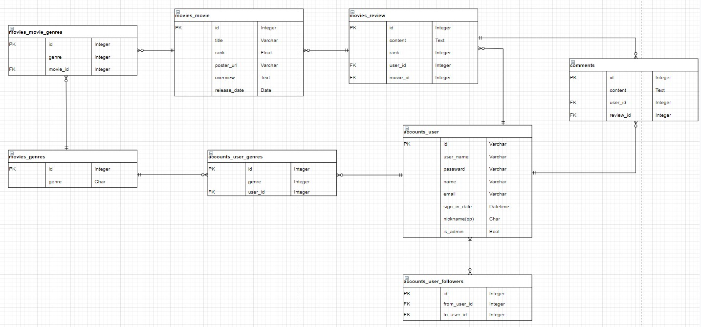
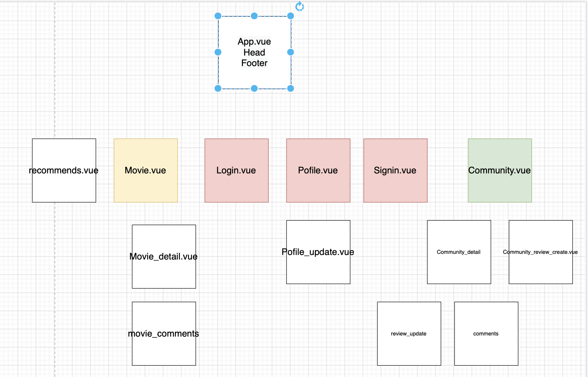
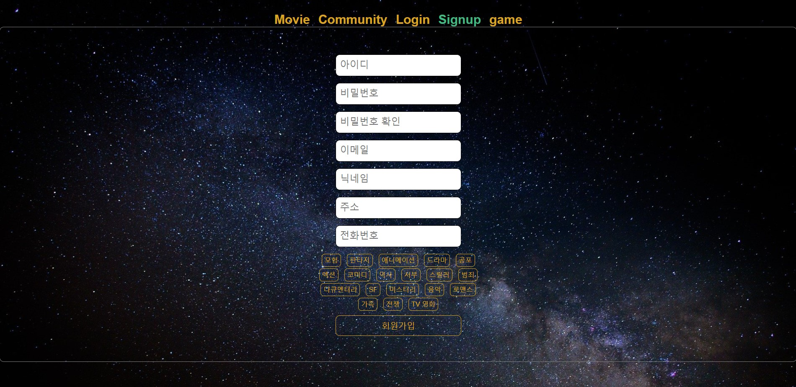
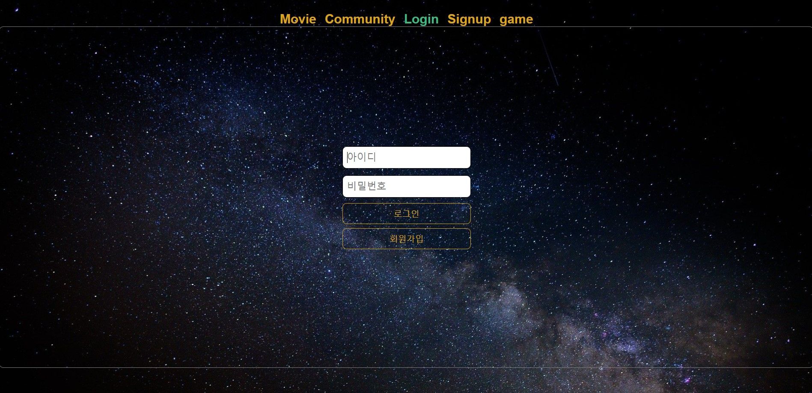
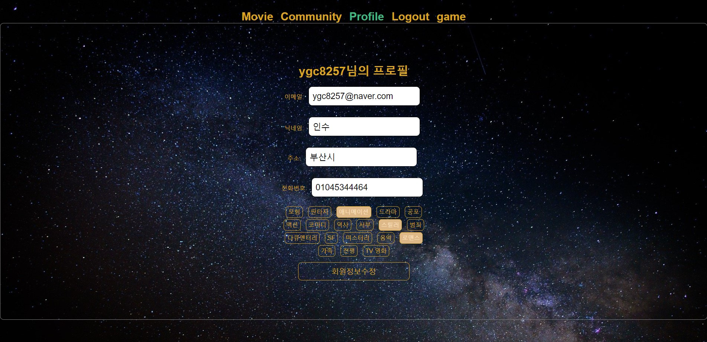
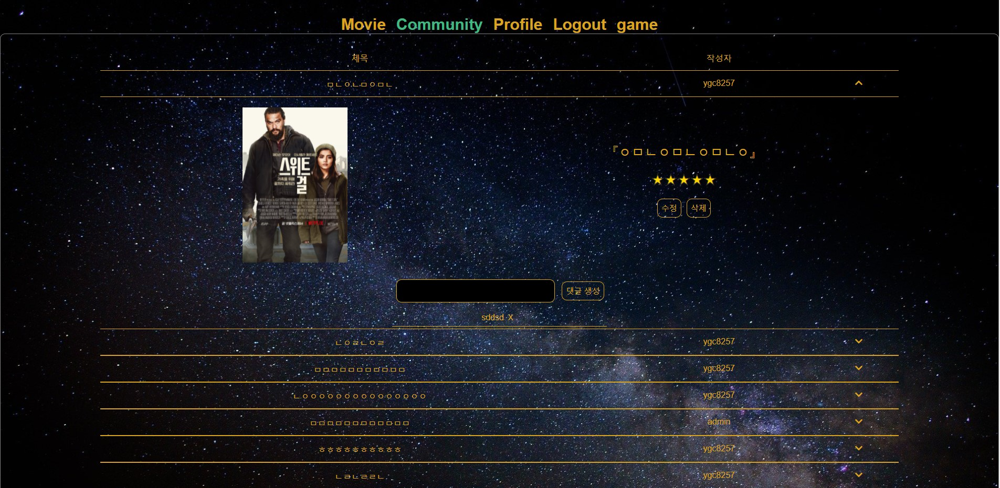
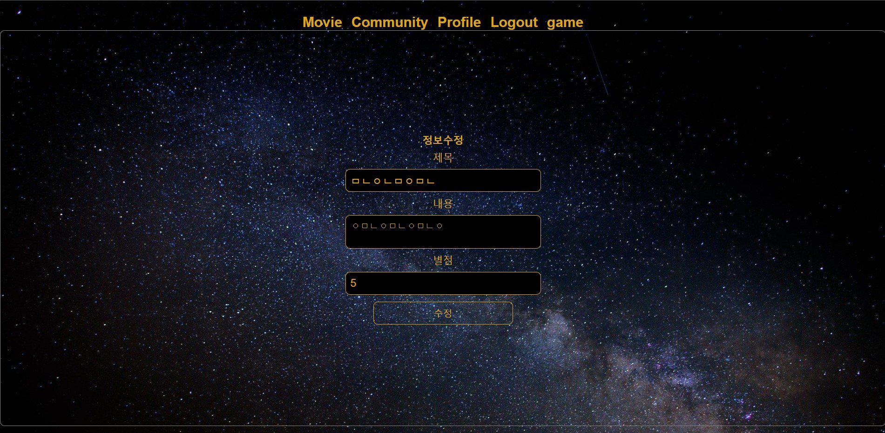
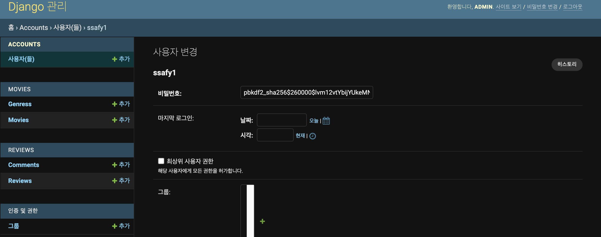
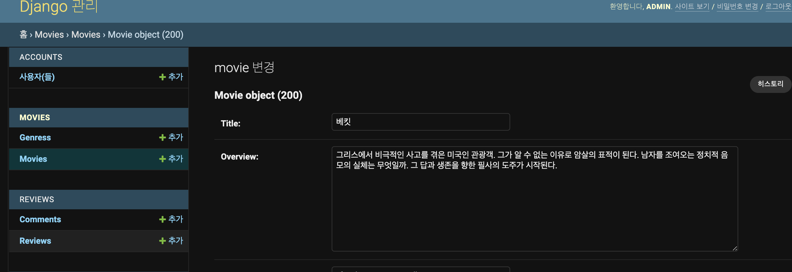

## SSAFY #6 관통 프로젝트(Movie Website Project)

<hr>

### Team

- 팀장 : 정인수
- 팀원 : 홍지범

#### 업무 분담 내역

- 정인수
  - front: login, signup, profile, community, review, CRUD, game
  - back: login, signup, profile. movie. recommend(초기버전),  review,  CRUD,  game 구현

- 홍지범
  - front : movie, recommend_movie, movie slide, review_create
  - back : login, signup, profile, movie, review, comments, CRUD

<hr>

## 목표,  개발환경, 요구사항 충족정도

## 1. 목표

```
- 영화 정보 기반 추천 서비스 구성
- 커뮤니티 서비스 구성
- HTML, CSS, JavaScript, Vue.js, Django, REST API, Data Base 등을 활용한 실제 서비스 설계
- 서비스 관리 및 유지보수
```

#### 설정 목표 및 실제 구현 정도

```
# 컨셉

커뮤니티를 접목한 영화 리뷰 사이트

# 기능

1. 관리자 뷰 [x]
2. 영화 정보 [x]
3. 추천 알고리즘 [x]
4. 커뮤니티 기능 [x]
5. 추가 기능 [x]

# 관리자뷰

admin 사용(필수) [x]

# 영화정보

기본적인 CRUD(필수) [x]

영화상세 → 영화 평점&코멘트(필수) [x]

로그인 기능(필수) [x]

# 추천 알고리즘

장르별(필수) [x]

추천별(옵션) [x]

관객수(옵션) [ ]

사이트 내 추천 순위(옵션) [ ]


# 커뮤니티

CRUD (필수) [x]

로그인 기능(필수) [x]

댓글(필수) [x]

이 달의 영화(옵션) [ ]

award(옵션) [ ]


# 추가기능

커뮤니티 확장(옵션) [ ]

리뷰어 구독(팔로우) [ ]

퀴즈(옵션) [x]

# 아키텍쳐

server : restAPI

client : vue.js
```


<hr>


### ERD



### Vue 앱 구성




<hr>


### 배포서버 URL

...

# 아키텍쳐

server : restAPI

client : vue.js


<hr>


## 2. 개발환경

#### 	A. 언어

​			i. Python 3.8+

​			ii. Django 3.2.6

​			iii. Node.js LTS

​			iv. Vue.js 2.6.14

#### 	B. 도구

​			i. VsCode

​			ii. Chrome Browser	

#### 	C. 아키텍처


#### 	D. 사용 패키지

​			i. npm install

```
├── @vue/cli-plugin-babel@4.5.15
├── @vue/cli-plugin-eslint@4.5.15
├── @vue/cli-plugin-router@4.5.15
├── @vue/cli-service@4.5.15
├── axios@0.24.0
├── babel-eslint@10.1.0
├── core-js@3.19.1
├── eslint-plugin-vue@6.2.2
├── eslint@6.8.0
├── i@0.3.7
├── npm@8.1.4
├── vue-router@3.5.3
├── vue-template-compiler@2.6.14
└── vue@2.6.14
```


​			 ii. pip install

```
Package                 Version
----------------------- -------
asgiref                 3.4.1
Django                  3.2.6
django-cors-headers     3.10.0
django-extensions       3.1.5
djangorestframework     3.12.4
djangorestframework-jwt 1.11.0
pip                     21.2.3
PyJWT                   1.7.1
pytz                    2021.1
setuptools              57.4.0
sqlparse                0.4.1
```


<hr>


## 3. 서비스 개요

	#### 	A. The Movie Database 사용

​		: API KEY를 활용하여 Django서버에 영화 데이터 저장

```python
# final-pjt/final-pjt-back/movies/views/
def moive_data_load(request):
  url = 'https://api.themoviedb.org/3/movie/popular'
  key = <api_key>
  ...
  
  # Installed 219 object(s) from 1 fixture(s)
```


### 	B. 프로젝트 구조

```
# back-end
├── final-pjt-back
	├── accounts(app)
	├── movies(app)
	├── reviews(app)
	├── server(project)
	
# front-end
├── final-pjt-front
	├── src
		├── components
			├── Movie
			├── MovieDetail
			├── Community
			├── game
			├── Login	
	├── router
	├── App.vue
	

```


### 	C. 영화 커뮤니티에 필요한 기능

- 회원가입




- 로그인 / 로그아웃




- 프로필 수정




		- 리뷰 / 댓글 작성 구현




		- 리뷰 수정 구현




		- 영화 퀴즈 구현


### 	D. 영화 추천 기능

: 회원의 선호장르를 통해 그 장르에 해당하는 영화를 추천한다.


### 	E. 스타일링

: HTML /  Core CSS를 활용해 스타일링 함.


<hr>

## 4. 요구사항

### 	A. 관리자뷰

i. 관지자 영화관리




ii. 관리자 유저관리




iii. 관리기능(Django admin 사용)

```python
# final-pjt/final-pjt-back/accounts/admin.py

admin.site.register(User)

# 관리자 께정 생성
# python manage.py createsuperuser

# 영화 정보 DB에 저장
# pyhton manaeg.py loaddata movies.json
```


### B. 영화 정보

로그인 유저(영화 평점 등록/수정/삭제)

- Review Create

```python
# back-end
# final-pjt/final-pjt-back/reviews/views.py

@api_view(['GET', 'POST'])
@permission_classes([AllowAny])
def review_list_create(request):
  .
  .
  .
    elif request.method == 'POST':
      review = request.data
      movie = get_object_or_404(Movie, pk = review['movie']['id'])
      user = get_object_or_404(User, username = review['user']['username'])
      if user or movie:
        review['user'] = user
        review['movie'] = movie
        
        serializer = CreateReviewSerializer(data = request.data)
        print(serializer)
        if serializer.is_valid(raise_exception=True):
          serializer.save(movie = movie, user = user)
          return Response(serializer.data, status=status.HTTP_201_CREATED)
```

```javascript
# front-end
# final-pjt/final-pjt/front/src/components/Community/Community_Review_Create.vue

<script>
  methods: {
      createReview: function() {
      if(this.review.title) {
        console.log(this.review)
        axios({
          method: "post",
          url : `http://127.0.0.1:8000/reviews/`,
          data : this.review,
        })
          .then(res => {
            console.log(res)
            this.$router.push({ name:"Community" })
          })
          .catch(err =>{
            console.log(err)
          })
        }
      },
 	 }
</script>

```

: 리뷰 작성

1. getUserName() 

   : 리뷰 작성페이지로 들어가면 created hook으로 인해  getUserName 함수가 작동한다.

 2. setToken() -> decoding by Server

    : gerUserName 함수 안에 있던 setToken함수로 인하여 jwt 토큰을  server의 views.py에서 decoding하여 유저 정보를 알아낸다.

3. getMovieid()

   : 이전 실행 함수가 성공시 순차적으로 작동하도록 하여 getMovieId함수를 작동해 리뷰 작성에 필요한 userid와 movieid, 작성한 리뷰 정보를 server로 보내 serializer에 저장해 리뷰를 작성한다.


### C. 추천 알고리즘

```javascript
# front-end
# final-pjt/final-pjt/front/src/components/Movie.vue

<script>
export default {
  name: 'Movie',
  computed: {
    moviesLens() {
      return this.movies.length
    }
  },
  data: function () {
    return {
      movies: null,
      genres: [],
      favorGenre: [],
      recomovies: [[], [], []],
    }
  },
  methods: {
    getMovie: function () {
      axios({
        method: 'get',
        url: "http://127.0.0.1:8000/movies/",
      })
      .then( res => {
        this.movies = res.data
        this.getGenre()
      })
      .catch(err => {
        console.log(err)
      })
    },
    getDetail: function(event) {
      console.log(event.target.data);
    },
    getGenre: function() {
      axios({
        mehtod: 'get',
        url: "http://127.0.0.1:8000/movies/genres"
      })
      .then( res=> {
        this.genres = res.data
        this.getFavoGenres()
      })
    },
    setToken: function () {
      const token = localStorage.getItem('jwt')
      const config = {
        Authorization: `JWT ${token}`
      }
      return config
    },
    getFavoGenres: function() {
      axios({
        method: "get",
        url:`http://127.0.0.1:8000/accounts/profile/`,
        headers: this.setToken()
      })
        .then((res)=>{
          this.favorGenre =res.data.genres
          for(var i = 0; i < 3; i ++) {
            this.$set(this.recomovies, i, this.filteredMovies(this.favorGenre[i]))
          }
        })
        .catch((err)=>{
          console.log(err);
        })
    },
    filteredMovies: function(gid) {
      const recommends = this.movies.filter(movie => {
        return movie.genre.some(g => {
          return g.id == gid
        })
       }) 
        return recommends
      },
  },
  created: function () {
    this.getMovie()
  },
}
</script>
```

: 사용자가 선택한 선호장르를 통해 추천 영화를 보여준다.

1. getMovie() 

   : Vue의 created hook을 통해 getMovie함수를 실행시켜 모든 영화정보를 얻는다. 

2. getGenre() 

   : getMovie함수가 실행 될 때 then에서 getGenre 함수를 실행시킴으로써 순차적으로 처리했다. 

3. getFavoGenre() -> decoding by Server 

   : 위와 같은 방식으로 getGenre함수가 성공하면 선호장르를 얻기 위한 함수를 jwt토큰을 서버에서 decoding하여 유저 정보를 받아온 후 유저 정보에서 선택했던 선호 장르를 가져온다. 

4. filteredMovie() 

   : 마찬가지로 선호장르를 가져오는 것을 성공하면 반복문을 통해 filterMovies에 파라미터로 넣어 전체영화 중 해당 장르와 일치하는  영화를 반환하여 추천 영화 리스트에 넣는다.

### 주의할 점

:  $set -> javascript에서는 이미 만들어진 변수에 대한 속성 추가, 제거를 감시할 수 없기 때문에 filteredMovie함수를 통해 얻은 추천 영화를 이미생성된 변수인 recomive에 넣을 수 없다.(슬라이드를 위한 index도 마찬가지!) 때문에 Vm.$set 인스턴스 메소드를 활용하여 변경된 속성에 대해 처리할 수 있었다.


### D. 커뮤니티(리뷰작성, 댓글달기 구현)

```python
# back-end

# final-pjt/final-pjt-back/reviews/models.py
class Review(models.Model):
  user = models.ForeignKey(settings.AUTH_USER_MODEL, on_delete=models.CASCADE)
  movie = models.ForeignKey('movies.Movie', on_delete=models.CASCADE, related_name='reviews')
  title = models.CharField(max_length=100)
  content = models.TextField()
  rank = models.FloatField(default = 5)


class Comment(models.Model):
  review = models.ForeignKey(Review, on_delete=models.CASCADE, related_name='comments')
  user_name = models.CharField(max_length=50)
  content = models.TextField()
  
# final-pjt/final-pjt-back/reviews/serializers.py
...
class CommentSerializer(serializers.ModelSerializer):
  class Meta:
    model = Comment
    fields = ('id', 'content', 'user_name', 'review',)
    read_only_fields = ('review',)
...
class CreateReviewSerializer(serializers.ModelSerializer):
  user = UserIdSerializer(read_only=True)
  movie = MovieIDSerializer(read_only=True)

  class Meta:
    model = Review
    fields = ('title', 'content', 'rank', 'user', 'movie')


# final-pjt/final-pjt-back/reviews/views.py
@api_view(['POST'])
def comment_create(request, review_pk):
  review = get_object_or_404(Review, pk=review_pk)
  serializer = CommentSerializer(data=request.data)
  if serializer.is_valid(raise_exception=True):
    serializer.save(review=review)
    return Response(serializer.data, status=status.HTTP_201_CREATED)

@api_view(['GET', 'DELETE'])
def comment_detail_delete(request, comment_pk):
  comment = get_object_or_404(Comment, pk = comment_pk)
  if request.method == 'GET':
    serializer = CommentSerializer(comment)
    return Response(serializer.data)

  elif request.method == 'DELETE':
    comment.delete()
    data = {
      'delete': f'{comment_pk}가 삭제되었습니다.'
      }
    return Response(data=data, status=status.HTTP_204_NO_CONTENT)
```


```javascript
# front-end

# final-pjt/final-pjt/front/src/components/Community/Community_Review_Create.vue
<script>
  methods: {
      createReview: function() {
      if(this.review.title) {
        console.log(this.review)
        axios({
          method: "post",
          url : `http://127.0.0.1:8000/reviews/`,
          data : this.review,
        })
          .then(res => {
            console.log(res)
            this.$router.push({ name:"Community" })
          })
          .catch(err =>{
            console.log(err)
          })
        }
      },
 	 }
</script>

# final-pjt/final-pjt/front/src/components/Community/Review_Comment.vue
<script>
export default {
  name : "Review_Comment",
  data:function(){
    return {
      delOk :false
    }
  },
  props :{
    comment: Object,
  },
  methods:{
    setToken: function(){
      const token = localStorage.getItem('jwt')
      const config ={
        Authorization: `JWT ${token}`
      }
      return config
    },
    comment_del: function() {
      axios({
        method: "delete",
        url : `http://127.0.0.1:8000/reviews/comments/${ this.comment.id }/`,
        headers: this.setToken(),
      })
        .then(res => {
          console.log(res)
          this.$emit("refresh")
        })
        .catch(err =>{
          console.log(err)
        })
    },
    chekc:function(){
      if (this.comment.user_name == localStorage.getItem("user_id")){
        this.delOk = true
      } else{
        this.delOk = false
      }
    }
  },
  created:function(){
    this.chekc()
  }
}
</script>

```

: jwt 토큰을 통해 로그인 된 유저만 리뷰작성과 수정, 삭제가 가능하고 리뷰 수정과 삭제는 현재 로그인된 userid와 작성자가 같은 경우에만 가능하도록 하게함.

