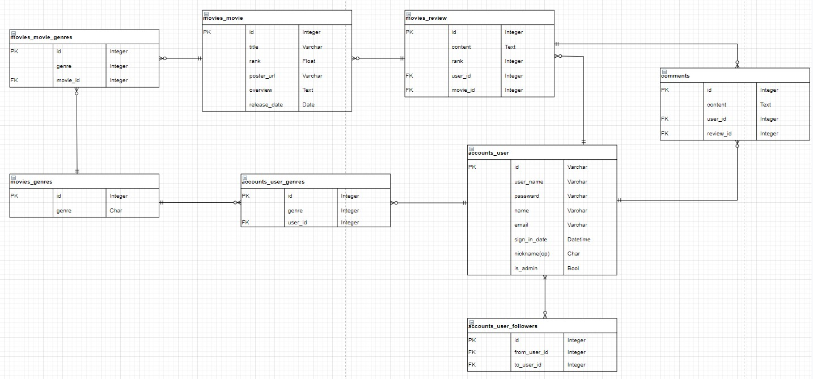

# Final-PJT

## day1

### 기획 및 컨셉 정하기

컨셉: 커뮤니티를 접목한 영화 리뷰 사이트

### 기능

1. 관리자 뷰
2. 영화 정보
3. 추천 알고리즘
4. 커뮤니티 기능
5. 추가 기능

### 1. 관리자뷰

admin 사용(필수)

### 2. 영화정보

기본적인 CRUD(필수)

영화상세 → 영화 평점&코멘트(필수)

로그인 기능(필수)

### 3. 추천 알고리즘

장르별(필수)

추천별(옵션)

관객수(옵션)

사이트 내 추천 순위(옵션)

**Kdd 유사도 기반 영화 추천 알고리즘**(옵션)

### 4. 커뮤니티

CRUD (필수)

로그인 기능(필수)

댓글(필수)

이 달의 영화(옵션)

award(옵션)

### 5. 추가기능

커뮤니티 확장(옵션)

리뷰어 구독(팔로우)

퀴즈(옵션)

## 아키텍쳐

server : restAPI

client : vue.js

### 데이터 베이스 ERD 뼈대 구성

추가 옵션 추가 예정

### vue 

vue 구성 내일 회의 예정

한줄평: 처음 프로젝트를 진행해보는거라 많이 헤매고 고쳐가며 열심히 만들었습니다.

API의 주어지는 데이터, 우리가 사용할 아키텍쳐 그리고 우리가 만들어보고 싶은 부분을 조합해서 기능을 적어놓았고 이후 더 추가될 예정입니다. 
