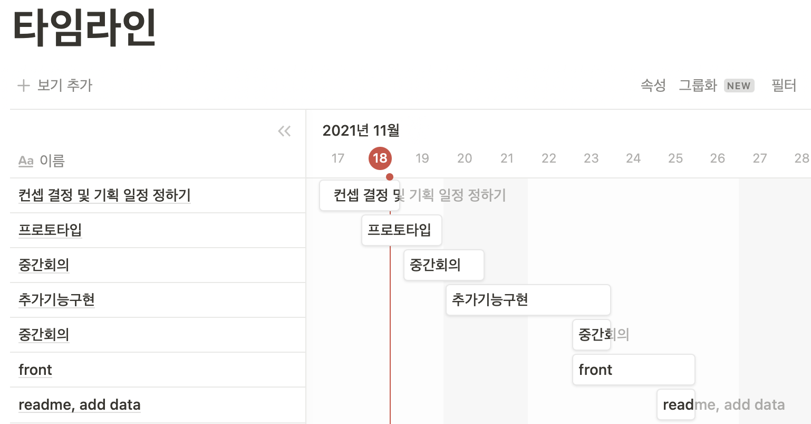

## day2

<hr>

### 뷰 페이지 구성

### 


### 전체 계획표 구성



### 프로토타입 CRUD 구성(진행중)

백엔드 : REST API를 활용한 영화 생성, 조회, 수정, 삭제 구현, Vue로 json형식의 자료를 보내기 위한 CORS 설정

프론트엔드 : 서버에서 보낸 json 형식의 전체 영화 정보를 Vue에서 보기 위한 조회 기능(Router, axios, life cycle 중 create hook  이용)


### 한줄평 : 

```
프론트엔드 구성 중 라우터와 axios를 활용하던 중 일어난 오류를 명확히 찾지 못해 많은 시간을 헤맸습니다.
Django에서 보낸 jason형태의 자료를 Vue에서 받기 위해 button에 이벤트를 걸어 응답을 확인하려 했으나 아무 동작이 없었고, 원인을 찾지 못해 일과시간을 거의 소비했습니다.
많이 당황했고 시간이 갈수록 조급해졌지만, 페어와 함께 처음부터 차근차근 결과를 확인해가며 놓친 부분을 찾을 수 있었습니다.
```


